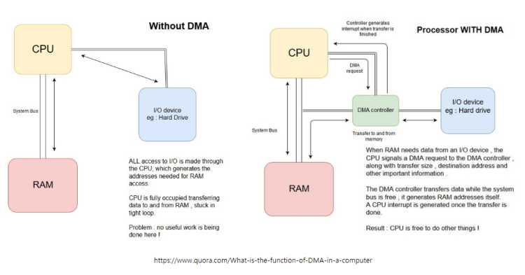

# DMA

- [DMA](#dma)
  - [DMA : Direct Memory Access](#dma--direct-memory-access)
  - [GPDMA : General Purpose DMA](#gpdma--general-purpose-dma)
  - [LPDMA : Low Power DMA](#lpdma--low-power-dma)
  - [Reference](#reference)

## DMA : Direct Memory Access

CPU 간섭 없이 데이터 전송을 가능하게 하는 기능

- DMA Controller : 주변장치, 메모리에 직접 접근하여 값을 읽거나 쓸 수 있음.

특정 메모리에 미리 DATA를 넣어 두고 CPU는 명령어만 준 뒤에 빠져나온다. 그러면 메모리에서 CPU를 거치지 않고 바로 데이터를 보내준다.

> DMA를 사용하는 주요 이점은 `메모리 매핑 소스(Source)에서 메모리 매핑 대상(Destination)으로의 데이터 전송을 위해 CPU의 부하를 오프로드`한다는 것

## GPDMA : General Purpose DMA

`일반 목적`의 DMA

`여러 채널을 지원`하여 `동시에 여러 개의 데이터 전송을 처리`할 수 있으며, `유연성과 확장성`을 제공

> 일반적으로 대량의 데이터를 처리해야 하는 애플리케이션에서 유용

## LPDMA : Low Power DMA

`저전력 소비`를 목표로 한 DMA

전력 소비를 최소화하면서도 효율적인 데이터 전송을 지원

`슬립 모드와 같은 저전력 상태에서도 데이터를 전송할 수 있는 기능`이 있어, `전력 관리에 최적화`

> 주로 배터리로 작동하는 모바일 기기나 IoT 장치에서 사용

## Reference
- [Just4Fun - DMA](https://embed-avr.tistory.com/130)
- [ST - How to configure the GPDMA](https://community.st.com/t5/stm32-mcus/how-to-configure-the-gpdma/ta-p/49412)
