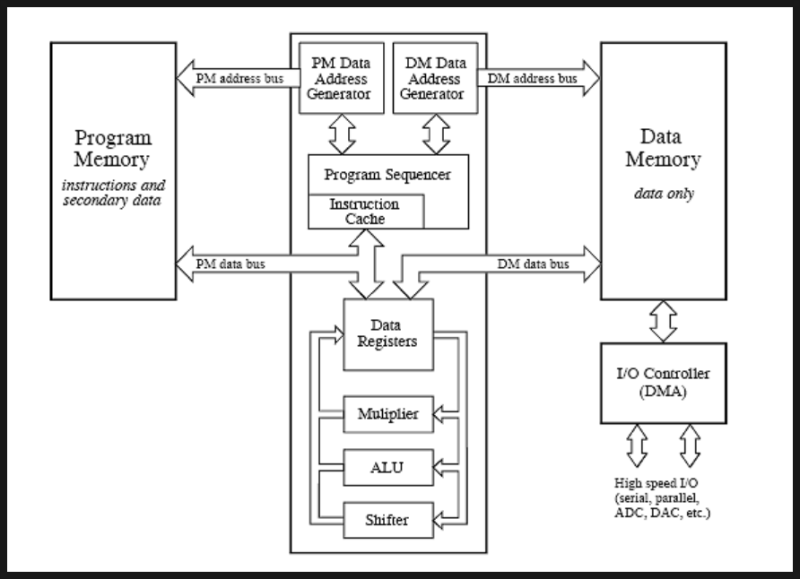

# DSP

- [DSP](#dsp)
  - [DSP : Digital Signal Processor](#dsp--digital-signal-processor)
  - [DSP 특징](#dsp-특징)
  - [DSP 기준](#dsp-기준)
  - [Reference](#reference)

## DSP : Digital Signal Processor

`디지털 신호 처리에 특화`된 기능과 성능을 제공하는 MCU

신호 처리 애플리케이션에 최적화되어 있으며, `고성능 연산`, `실시간 처리`, `복잡한 알고리즘 실행` 등을 위한 특수 기능을 갖추었다.

> 음성 처리, 영상 처리, 음악 재생, 영상 및 오디오 압축, 자동차 제어 시스템, 의료 이미징 장비, 제어 시스템, 통신 시스템 등 다양한 분야에서 사용

## DSP 특징

1. [SIMD](SIMD.md)

    동시에 다수의 데이터를 `병렬 처리`함으로써 고속 연산을 가능하게 함.

2. 높은 연산 처리량

    고속 연산을 위한 `병렬 처리 기능`을 통해 알고리즘 수행 효율적으로 가능함.

3. 고속 데이터 스트림 처리

    `높은 데이터 처리 속도` 지원해 실시간 지원함.

4. 부동 소수점 연산

    고정 소수점 연산과 부동 소수점 연산 지원함. `부동 소수점 연산은 정밀한 계산이 필요한 애플리케이션에서 유용`함.

5. 주기억장치와 프로그램 메모리 분리

    `데이터 메모리와 프로그램 메모리 분리하여 데이터에 빠르게 접근하고 처리`할 수 있도록 설계됨.

6. 필터 기능

    `디지털 필터를 HW적으로 구현`하는 기능이 있어 `신호 처리 작업에 적합`함.

7. [DMA](DMA.md)

    `데이터 전송을 CPU 개입 없이 빠르게` 수행 가능.

## DSP 기준

DSP인지 아닌지의 기준은 명확하지 않음.
일반적으로 위의 [특징](#dsp-특징)을 가지고 있으면 DSP라고 간주한다.

## Reference

- [윌리의 Technical Reference - DSP 디지털 신호 처리 장치(Digital Signal Processor)란? 프로세서의 특징, 구성, 기준, 사용 분야](https://m.blog.naver.com/techref/223152356645)
