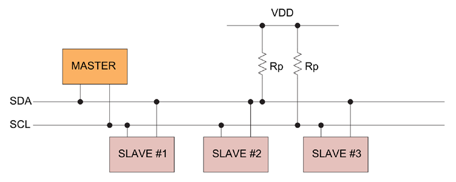
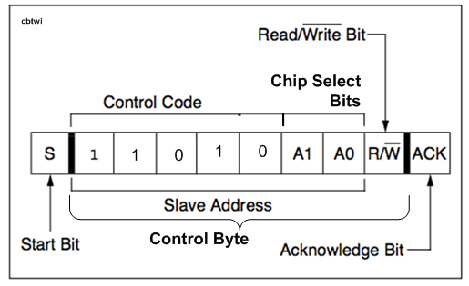
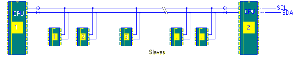
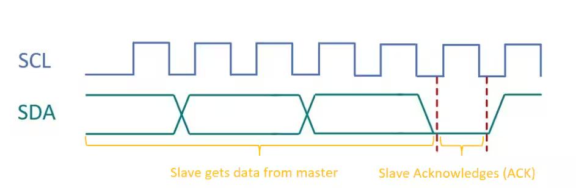
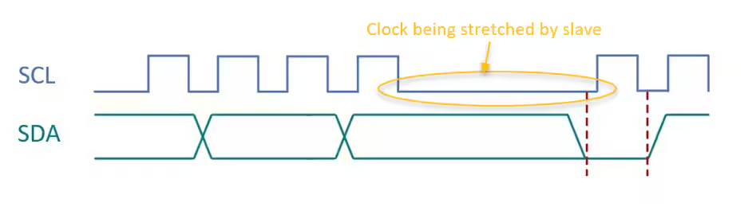

# I2C

- [I2C](#i2c)
  - [I2C(Inter-Integrated Circuit)](#i2cinter-integrated-circuit)
    - [SDA](#sda)
    - [SCL](#scl)
  - [I2C Modes](#i2c-modes)
    - [Sm : Standard-Mode](#sm--standard-mode)
    - [Fm : Fast-Mode](#fm--fast-mode)
    - [Fm+](#fm)
    - [HSm : High-speed mode](#hsm--high-speed-mode)
    - [UFm : Ultra Fast-mode](#ufm--ultra-fast-mode)
  - [I2C Data Format](#i2c-data-format)
  - [Mode between Master \& Slave](#mode-between-master--slave)
    - [보드 설정](#보드-설정)
    - [블로킹 모드 (Blocking Mode)](#블로킹-모드-blocking-mode)
    - [인터럽트 모드 (Interrupt Mode)](#인터럽트-모드-interrupt-mode)
    - [DMA 모드 (DMA Mode)](#dma-모드-dma-mode)
  - [Reference](#reference)

## I2C(Inter-Integrated Circuit)
1982 Phillips Semiconductors에서 개발한 `직접 회로 간에 사용되는 2선 직렬 통신 시스템`이다.



`SDA`와 `SCL`선은 `저항으로 풀업`해야 하고, 저항값은 버스 길이와 전송 속도에 따라 달라진다. (일반적으로는 4.7kΩ)

### SDA
`Serial Data`는 마스터와 슬레이브가 정보를 보내거나 받는 선이다. (Sequence of Bits)

>H : 1, L : 0

### SCL
`Serial Clock`은 데이터 흐름 동기화를 위한 전용 클록 선이다.

>H : Data Stable, L : Data Change

## I2C Modes
I2C의 모드는 `비트 전송률`에 따라 다섯 가지로 나눌 수 있다.
### Sm : Standard-Mode
`최대 100kbit/s`의 비트 전송률
### Fm : Fast-Mode
`최대 400kbit/s`의 비트 전송률
### Fm+
`최대 1Mbit/s`의 비트 전송률
### HSm : High-speed mode
`최대 3.5Mbit/s`의 비트 전송률
### UFm : Ultra Fast-mode
`최대 5Mbit/s`의 비트 전송률

## I2C Data Format

- 아래 표를 참고해 읽을 수 있다.
- [`MSB`](MSBvsLSB.md#msb) First이다.

| Acronyms | Mean                              | SDA   | SCL       | Feature                                       |
| -------- | --------------------------------- | ----- | --------- | --------------------------------------------- |
| `S`      | Start Bit / Condition             | H → L | H         | 데이터 전송 시작                              |
| `P`      | Stop Bit                          | L → H | H         | 데이터 전송 종료                              |
| `Sr`     | Repeated Start(Restart) Condition | H → L | H         | 종료 없이 새 전송 시작                        |
| `R `     | Read Bit                          | L     | L → H → L | 슬레이브에서 데이터 읽기 요청                 |
| `W\`     | Write Bit                         | L     | L → H → L | 슬레이브에 데이터 쓰기 요청                   |
| `A`      | Acknowledge (ACK)                 | L     | L → H → L | DATA BYTE 이후, 슬레이브가 데이터 수신 완료함 |
| `A\`     | Not Acknowledge (NACK)            | L     | L → H → L | DATA BYTE 이후, 슬레이브가 데이터 수신 실패함 |

- `Slave Address`: 슬레이브 장치의 고유 주소.<br>
  
  - Address는 기본 7bit이지만, Device에 따라 10bit로도 할 수 있다.

- `Data Byte`: 전송되는 실제 데이터. 보통 8비트. (주소일 경우 7Bit 주소, 1Bit R/W\)

- `Bus Arbitration`: 여러 마스터가 버스를 사용할 때 충돌을 피하는 과정.<br>
  <br>
  사진과 같이 Master MCU가 여러 개 있을 때, 두 마스터가 같은 슬레이브를 동시에 사용하려고 하면 충돌이 일어난다. 충돌을 피하기 위해 늦게 액세스한 마스터는 전송을 잠시 늦춘다(bus에 STOP이 있을 때 까지)

- `Clock Stretching`: 슬레이브가 처리 시간을 요구할 때 클럭 신호를 지연시키는 기능<br>
  <br>
  ***[Expected Slave Clock Behavior with no Clock Stretching]***<br>
  <br>
  ***[Clock Stretching during hub suspend]***

## Mode between Master & Slave
stm32 보드에서의 간단한 설정을 위한 코드와, 각 모드에 대한 설명이다.

### 보드 설정
- Master
  ```c
  /* USER CODE BEGIN PV */
  /* Private variables */
  uint8_t TX_Buffer [] = "A" ; // DATA to send
  /* USER CODE END PV */
  ```
- Slave
  ```c
  /* USER CODE BEGIN PV */
  /* Private variables */
  uint8_t RX_Buffer [1] ; // DATA to receive
  /* USER CODE END PV */
  ```

### 블로킹 모드 (Blocking Mode)

|특징|사용|
|---|---|
|- 전송 또는 수신 `작업이 완료될 때까지 CPU가 대기`합니다.<br>- `간단한 구조`로 구현하기 쉽습니다.|- 데이터 `전송이 간단하고, 시스템의 다른 작업과 병행할 필요가 없을 때` 사용합니다.<br>- `작은 프로젝트나 실험적인 코드에서 빠르게 테스트할 때` 유용합니다.|

- Master
  ```c
  /* USER CODE BEGIN 2 */
    HAL_I2C_Master_Transmit(&hi2c1,20,TX_Buffer,1,1000); //Sending in Blocking mode
    HAL_Delay(100);
  /* USER CODE END 2 */
  ```
- Slave
  ```c
  /* USER CODE BEGIN 2 */
    HAL_I2C_Slave_Receive(&hi2c1 ,(uint8_t *)RX_Buffer, 1,1000); //Receiving in Blocking mode
    HAL_Delay(100);
  /* USER CODE END 2 */
  ```

### 인터럽트 모드 (Interrupt Mode)

|특징|사용|
|---|---|
|- `전송 및 수신 작업이 비동기`적으로 이루어집니다.<br>- `데이터 전송이 완료되면 인터럽트를 통해 CPU에 알립`니다.|- `여러 작업을 동시에 수행해야 하는 경우` (예: 다른 센서 데이터 처리 또는 사용자 인터페이스 반응).<br>- 블로킹 모드에서 발생할 수 있는 `지연을 피하고 싶을 때` 사용합니다.<br>- `데이터 통신이 불규칙할 경우` 유용합니다.|

- Master
  ```c
  /* USER CODE BEGIN 2 */
    HAL_I2C_Master_Transmit_IT(&hi2c1,20,TX_Buffer,1); //Sending in Interrupt mode
    HAL_Delay(100);
  /* USER CODE END 2 */
  ```
- Slave
  ```c
  /* USER CODE BEGIN 2 */
    HAL_I2C_Slave_Receive_IT(&hi2c1 ,(uint8_t *)RX_Buffer, 1); //Receiving in Interrupt mode
    HAL_Delay(100);
  /* USER CODE END 2 */
  ```

### DMA 모드 (DMA Mode)

|특징|사용|
|---|---|
|- `CPU의 개입 없이 직접 메모리 접근을 통해 데이터를 전송`합니다.<br>- `대량의 데이터`를 전송할 때 유리하며, `CPU의 부담을 줄입`니다.|- `대량의 데이터 전송이 필요한 경우` (예: 이미지 처리, 센서 데이터 수집).<br>- `CPU가 다른 작업을 동시에 수행해야 할 때`, 특히 `실시간 시스템`에서 효율적입니다.<br>- `높은 데이터 전송 속도가 요구되는 경우`에 적합합니다.|

- Master
  ```c
  /* USER CODE BEGIN 2 */
    HAL_I2C_Master_Transmit_DMA(&hi2c1,20,TX_Buffer,1); //Sending in DMA mode
    HAL_Delay(100);
  /* USER CODE END 2 */
  ```
- Slave
  ```c
  /* USER CODE BEGIN 2 */
    HAL_I2C_Slave_Receive_DMA(&hi2c1 ,(uint8_t *)RX_Buffer, 1); //Receiving in DMA mode
    HAL_Delay(100);
  /* USER CODE END 2 */
  ```

## Reference
- [STM32 - Getting started with I2C](https://wiki.st.com/stm32mcu/wiki/Getting_started_with_I2C#)
- [Analog Devices - I2C Primer: What is I2C? (Part 1)](https://www.analog.com/en/resources/technical-articles/i2c-primer-what-is-i2c-part-1.html)
- [Arduino FORUM](https://forum.arduino.cc/t/i2c-addressing-registers-and-bits/543946)
- [MICROCHIP - I2C Clock Stretching with Microchip USB Hubs](https://microchip.my.site.com/s/article/I2C-Clock-Stretching-with-Microchip-USB-Hubs)
- [esacademy - Bus Arbitration](https://www.esacademy.com/en/library/technical-articles-and-documents/miscellaneous/i2c-bus/general-introduction/bus-arbitration.html)
