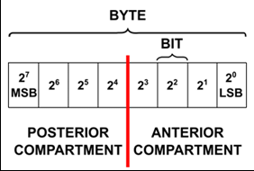

# MSB vs LSB
> Bit로 통신할 때는 `MSB`인지 `LSB`인지 유의해서 프로그래밍 할 필요가 있다. 그럼, MSB와 LSB가 뭐길레 유의해야 하는지 알아보자.

- [MSB vs LSB](#msb-vs-lsb)
  - [MSB : Most Significant Bit](#msb--most-significant-bit)
  - [LSB : Least Significant Bit](#lsb--least-significant-bit)

## MSB : Most Significant Bit
데이터 형의 최 상위 비트   **`(signed에서는 부호!)`**  

## LSB : Least Significant Bit
데이터 형의 최하위 비트
