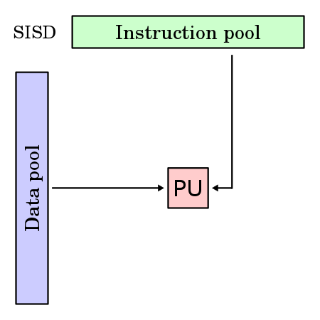

# Multi Processor

- [Multi Processor](#multi-processor)
  - [SISD : Single Instruction Single Data](#sisd--single-instruction-single-data)
  - [SIMD : Single Instruction, Multiple Data](#simd--single-instruction-multiple-data)
  - [MISD : Multi Instruction, Single Data](#misd--multi-instruction-single-data)
  - [MIMD : Multi Instruction, Multi Data](#mimd--multi-instruction-multi-data)
  - [Reference](#reference)

|유형|명령어|데이터|
|---|---|---|
|[SISD](#sisd--single-instruction-single-data)|단일|단일|
|[SIMD](#simd--single-instruction-multiple-data)|단일|복수|
|[MISD](#misd--multi-instruction-single-data)|복수|단일|
|[MIMD](#mimd--multi-instruction-multi-data)|복수|복수|

## SISD : Single Instruction Single Data

||<mark>폰 노이만 구조</mark>에 해당함  하나의 명령어가 하나의 데이터를 처리하는 방식  CPU가 `한 번에 하나의 명령어를 실행`하고, `각 명령어가 하나의 데이터에 처리`됨.  일반적인 컴퓨터의 방식으로 `순차적으로 작업을 처리`함.|
|---|---|

## SIMD : Single Instruction, Multiple Data

||하나의 명령어가 다수의 데이터를 한 번에 처리하는 방식  CPU가 `한 번의 명령어로 여러 개의 데이터에 동시에 작업 수행`  `벡터 연산이나 배열 처리`에 매우 효율적이며, `병렬 처리`를 통해 성능을 크게 향상시킬 수 있음.|
|---|---|

## MISD : Multi Instruction, Single Data

||다수의 명령어가 하나의 데이터를 처리하는 방식  `파이프라인 아키텍처`, 처리 오류 막기 위해 동일 명령어 중복 실행하는 `무정지 컴퓨터`가 여기에 속함.|
|---|---|

## MIMD : Multi Instruction, Multi Data

||다수의 명령어가 다수의 데이터를 처리하는 방식  `비동기적, 독립적으로 동작하는 여러 개의 프로세서`가 각기 다른 여러 명령어를 실행함.  메모리 사용에 따라 공유 메모리나 분산 메모리로 나뉨.  - `공유 메모리` : 버스 기반, 확장 또는 계층 형태 - `분산 메모리` : 하이퍼큐브 혹은 메시 상호연결 기법 사용|
|---|---|

## Reference

- [Fasoo 공식블로그 - SIMD(Single Instruction Multiple Data)에 대한 집중탐구!](https://blog.naver.com/fs0608/221650925743)
- [다은하게 - 멀티프로세서의 유형 : SISD, SIMD, MISD, MIMD](https://daanist.tistory.com/25)
