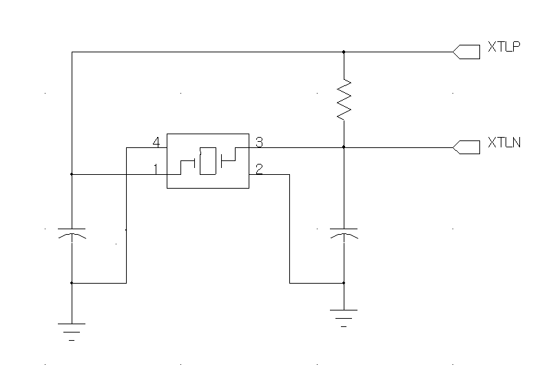
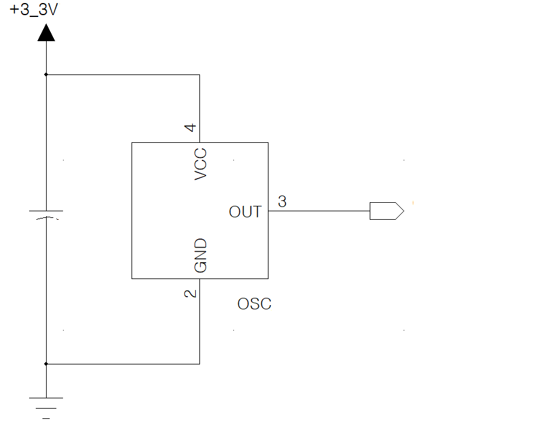

# Oscillator

- [Oscillator](#oscillator)
  - [Reference](#reference)

||회로|특징|사용|
|---|---|---|---|
|Crystal Unit / X-TAL|PIN(2) : XTAL_IN, XTAL_OUT  `수동 소자`로 발진 회로가 필요하다.|주로 발진회로가 내장된 IC를 사용할 경우에 사용한다.  OSC에 비해 `저렴한 가격`이라 대량생산의 경우 주로 사용한다.  두께가 얇아질 수록 주파수가 증가한다. 이에 따라 `트리머를 사용한 미세한 주파수 조정`이 필요하다.|1. X-TAL 발진 회로가 내장된 IC를 사용하는 경우  2. 정밀한 주파수가 필요할 때 X-TAL과 트리머를 사용해 주파수를 조정해서 사용  3. 대량 생산인 경우|
|Crystal OSC|PIN(4) : VOLTAGE, GND, OUTPUT, N.C  `능동 소자`로 전원 공급만 되면 발진 신호가 출력된다.|`수십 MHz 이상의 주파 수원`을 필요로 하는 경우 사용한다.  `비싼 가격`이라 신뢰성을 원하는 경우 사용한다.  주파수를 조정할 필요 없이 사용 가능하다.|1. 발전 회로를 꾸밀 자신이 없는 경우  2. 가격보다 신뢰성이 중요한 경우  3. 수십 MHz 이상의 발진 주파수가 필요한 경우|
|||||

## Reference
- [월간 전자 연구소 - [회로설계 - 기초이론] 오실레이터(OSC) 와 크리스탈(CRYSTAL) 비교 (차이)](https://electronic-king.tistory.com/3)
- [네이버 블로그 밤이 어두울 때 더 많은 별을 보게된다. - 크리스탈[X-TAL과 오실레이터[OSC]의 부품 차이]](https://m.blog.naver.com/hhs4040/221092458910)