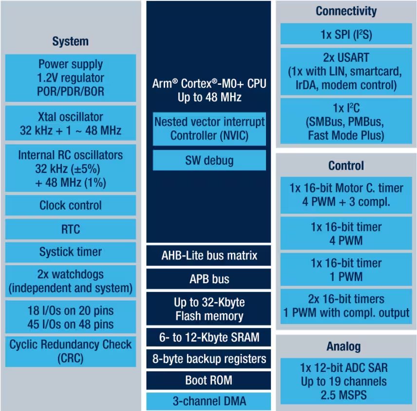

# timer

- [timer](#timer)
  - [Circuit Diagram](#circuit-diagram)
    - [1x 16-bit Motor C.timer 4 PWM + 3 compl.](#1x-16-bit-motor-ctimer-4-pwm--3-compl)
    - [1x 16-bit timer 4 PWM](#1x-16-bit-timer-4-pwm)
    - [1x 16-bit timer 1 PWM](#1x-16-bit-timer-1-pwm)
    - [2x 16-bit timers 1 PWM with compl. output](#2x-16-bit-timers-1-pwm-with-compl-output)

## Circuit Diagram

회로도 다이어그램을 보면, Control에 
- 1x 16-bit Motor C.timer 4 PWM + 3 compl.
- 1x 16-bit timer 4 PWM
- 1x 16-bit timer 1 PWM
- 2x 16-bit timers 1 PWM with compl. output
이렇게 4개의 타이머가 있는 것을 확인할 수 있다.

### 1x 16-bit Motor C.timer 4 PWM + 3 compl.
`16-bit Motor C Timer 4 PWM`: 

    16-bit 해상도를 가진 PWM (Pulse Width Modulation) 신호를 생성.
    'Motor C'는 특정 모터 제어 기능에 사용되는 PWM을 생성하는 타이머.

`Compl. Outputs (3)`: 

    3개의 보완 출력(complementary outputs)을 제공
    보완 출력은 PWM 신호의 반대 신호를 생성하여 H-브리지 회로와 같은 모터 제어에 유용함. H-브리지는 모터의 회전 방향과 속도를 제어하는 데 사용.

### 1x 16-bit timer 4 PWM
`16-bit Timer 4 PWM`: 

    일반적인 16-bit PWM 신호를 생성.
    특정 모듈이나 장비에서 PWM 신호를 생성하여 주파수와 듀티 사이클을 조절할 수 있음.

### 1x 16-bit timer 1 PWM
`16-bit Timer 1 PWM`: 

    타이머 1을 사용하여 16-bit PWM 신호를 생성.
    이 PWM은 다양한 출력 장치에 신호를 제공.

### 2x 16-bit timers 1 PWM with compl. output
`2x 16-bit Timers 1 PWM with Compl. Output`: 

    두 개의 16-bit 타이머가 각각 보완 출력(complementary output)을 제공. 이는 더 정밀한 PWM 제어를 가능하게 하며, 특히 H-브리지와 같은 복잡한 회로에서 유용.
