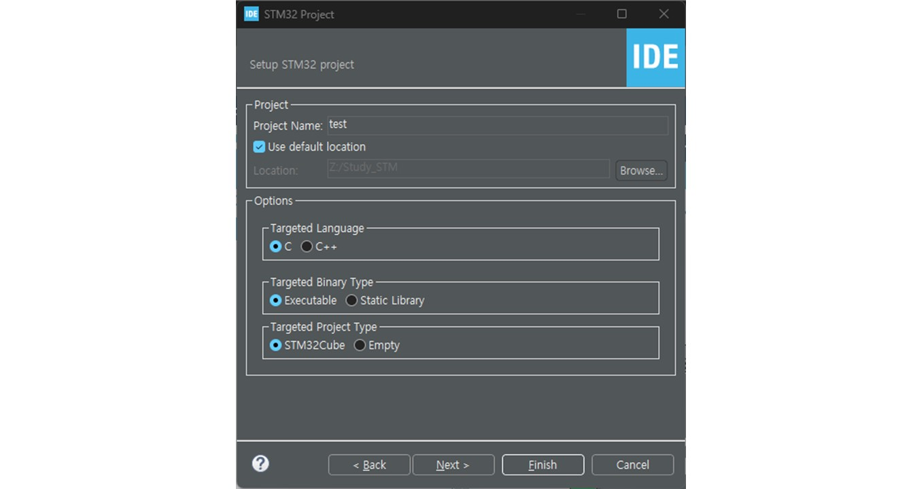

# STM32Cube Tutorial
IDE : `STM32CubeMX 1.8.6`, `STM32CubeIDE 1.16.0`

STM32 마이크로컨트롤러와 마이크로프로세서를 위한 개발 도구

- [STM32Cube Tutorial](#stm32cube-tutorial)
  - [MCU/MPU Selector](#mcumpu-selector)
    - [MCU/MPU Selected](#mcumpu-selected)
    - [MCU/MPU Block Diagram](#mcumpu-block-diagram)
    - [MCU/MPU CAD Resources](#mcumpu-cad-resources)
    - [MCU/MPU Data Sheet](#mcumpu-data-sheet)
    - [MCU/MPU Docs and Resources](#mcumpu-docs-and-resources)
  - [Board Selector](#board-selector)
    - [Board Selected](#board-selected)
    - [Board Data Sheet](#board-data-sheet)
    - [Board Docs and Resources](#board-docs-and-resources)
  - [Example Selector](#example-selector)
  - [Cross Selector](#cross-selector)
  - [Selected](#selected)

## MCU/MPU Selector
`MCU (Microcontroller Unit)와 MPU (Microprocessor Unit)를 선택할 때 사용`하는 도구
사용자는 필요로 하는 성능, 메모리 크기, 입출력 핀 수 등 다양한 요구 사항을 입력하면, 해당 요구 사항에 맞는 STM32 MCU 또는 MPU를 찾을 수 있음.

### MCU/MPU Selected

### MCU/MPU Block Diagram

### MCU/MPU CAD Resources

### MCU/MPU Data Sheet

### MCU/MPU Docs and Resources

## Board Selector
`개발 보드나 평가 보드를 선택할 때 사용`하는 도구
원하는 MCU 또는 MPU를 기반으로, 해당 칩이 탑재된 개발 보드나 평가 보드를 검색하고 선택할 수 있음. 
보드의 사양, 가격, 기능 등을 확인 가능

### Board Selected

### Board Data Sheet

### Board Docs and Resources

## Example Selector
STM32CubeMX에서 제공하는 다양한 `코드 예제를 검색하고 선택`할 수 있는 도구
특정 MCU 또는 기능에 맞는 코드 예제를 찾아보고, 이를 통해 개발 시 참고할 수 있는 코드 샘플을 쉽게 찾을 수 있음

## Cross Selector
`다양한 STM32 MCU/MPU 제품 간의 비교`를 돕는 도구
여러 제품을 선택하여 그들의 기술적 사양, 성능, 기능 등을 비교할 수 있습니다. 이를 통해, 특정 프로젝트에 가장 적합한 MCU/MPU를 결정할 수 있음.

## Selected
선택이 되면 프로젝트 설정을 할 수 있고, 이후 프로젝트가 시작된다.

