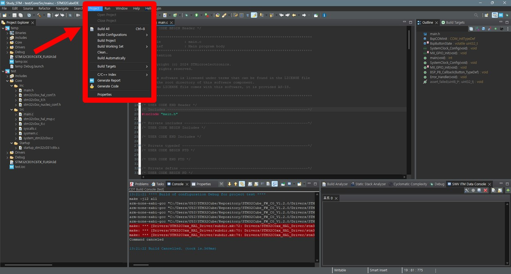
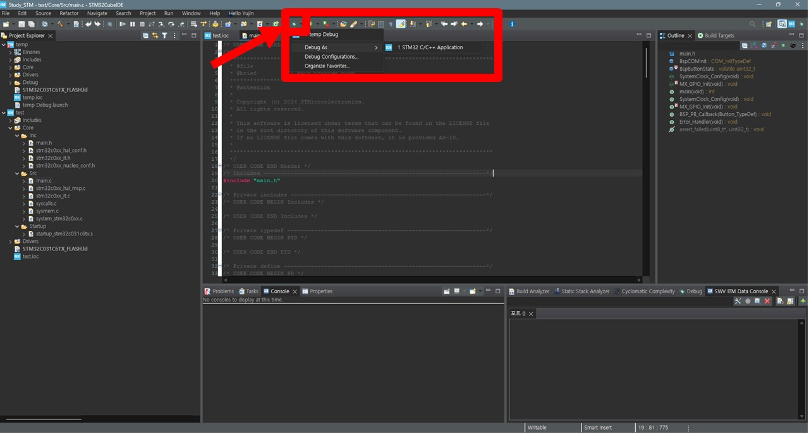
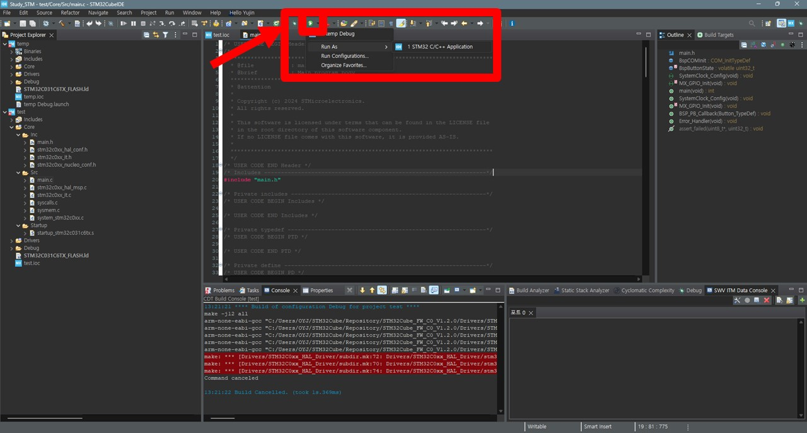

# Start Project
IDE : `STM32CubeIDE 1.16.0`

- [Start Project](#start-project)
  - [Directory](#directory)
  - [Build, Debugging, Run](#build-debugging-run)
    - [Build](#build)
    - [Debugging](#debugging)
    - [Run](#run)
  - [MEMORY : Flash vs RAM](#memory--flash-vs-ram)
    - [Flash memory](#flash-memory)
    - [RAM memory](#ram-memory)
    - [Memory in STM32](#memory-in-stm32)

## Directory


프로젝트가 생성되면 창 왼쪽에 위와 같이 파일이 생성된 것을 확인할 수 있다. 아래는 test라는 프로젝트(C base)의 파일 구조이다.

```
📦test ------------------------------------ root directory 
 ┣ 📂.settings 
 ┃ ┣ 📜org.eclipse.core.resources.prefs --- Eclipse IDE Workspace Settings(이클립스 IDE의 워크스페이스 설정)
 ┃ ┣ 📜language.settings.xml -------------- Code & Compiler Lang Settings(코드 편집기 및 컴파일러의 언어 설정)
 ┃ ┗ 📜stm32cubeide.project.prefs --------- STM32CubeIDE PJT Settings (프로젝트에 관련된 설정)
 ┣ 📂Core
 ┃ ┣ 📂Src -------------------------------- Source Files
 ┃ ┃ ┣ 📜stm32c0xx_it.c ------------------- Interrupt Handler (인터럽트 핸들러 구현)
 ┃ ┃ ┣ 📜stm32c0xx_hal_msp.c -------------- STM32 HAL MSP Functions (HAL MCU Supporter Package 함수 구현)
 ┃ ┃ ┣ 📜main.c --------------------------- Main Application Code (메인 코드 구현)
 ┃ ┃ ┣ 📜system_stm32c0xx.c --------------- System Reset & Clock Settings (시스템 초기화 및 클록 설정)
 ┃ ┃ ┣ 📜syscalls.c ----------------------- System Call (시스템 호출 구현)
 ┃ ┃ ┗ 📜sysmem.c ------------------------- Memory Functions (메모리 관리 관련 기능 구현)
 ┃ ┣ 📂Inc -------------------------------- Header Files
 ┃ ┃ ┣ 📜stm32c0xx_nucleo_conf.h ---------- Nucleo Board Settings (보드 관련 설정)
 ┃ ┃ ┣ 📜stm32c0xx_it.h ------------------- Interrupt Handler Functions (인터럽트 핸들러에 대한 함수 선언)
 ┃ ┃ ┣ 📜stm32c0xx_hal_conf.h ------------- STM32 HAL Library Settings (HAL 라이브러리 설정 정의)
 ┃ ┃ ┗ 📜main.h --------------------------- main.c Functions & Variables (main.c에서 사용되는 함수와 변수 선언)
 ┃ ┗ 📂Startup ---------------------------- Reset Codes
 ┃ ┃ ┗ 📜startup_stm32c031c6tx.s ---------- STM32 Micro Controller's Start-up code (STM32 마이크로컨트롤러의 스타트업 코드가 포함된 어셈블리 파일)
 ┣ 📂Drivers
 ┃ ┣ 📂BSP -------------------------------- Board Support Package
 ┃ ┃ ┗ 📂STM32C0xx_Nucleo ----------------- Nucleo 보드 관련된 BSP파일
 ┃ ┗ 📂STM32C0xx_HAL_Driver
 ┣ 📜.project ----------------------------- Eclipse Project Metadatas, IDE's PJT Settings
 ┣ 📜STM32C031C6TX_FLASH.ld --------------- Linker Script File, Define Memory Layout
 ┣ 📜.cproject ---------------------------- Eclipse C/C++ PJT Settings, build settings
 ┣ 📜.mxproject --------------------------- STM32CubeMX PJT File
 ┗ 📜test.ioc ----------------------------- STM32CubeMX Setting File, Pin & Clock & External Devices settings
```

## Build, Debugging, Run

### Build



코드를 컴파일하고 링크하여 실행 가능한 프로그램을 생성하는 과정<br> 
Eclipse IDE에서는 "Build" 버튼을 사용하여 이 작업을 수행할 수 있음

### Debugging



프로그램의 동작을 검사하고 오류를 수정하는 과정<br>
STM32CubeIDE에서 디버깅을 시작하면 브레이크포인트를 설정하고 변수의 값을 검사할 수 있음

### Run



빌드된 프로그램을 실제로 실행하여 동작을 확인하는 단계<br> 
IDE에서 "Run" 버튼을 클릭하여 이 작업을 수행할 수 있음

## MEMORY : Flash vs RAM 

### Flash memory
> 비휘발성 메모리 : 프로그램 코드와 상수 데이터 저장. 전원이 꺼져도 데이터가 유지

부트로더(부팅 시 실행되는 코드)와 사용자 애플리케이션 코드가 저장<br>
일반적으로 프로그램이 시작될 때 Flash 메모리에서 코드를 읽어와 RAM에 로드

### RAM memory
> 휘발성 메모리 : 실행 중인 코드와 변동 데이터 저장. 전원이 꺼지면 데이터가 사라짐

프로그램 실행 시 코드와 변수를 저장하고, 실행 중에 필요한 임시 데이터나 스택 공간으로 사용

### Memory in STM32
STM32는 부팅 시 Flash memory에 저장된 코드부터 실햄함. 부트로더는 플래시 메모리에서 프로그램을 읽어 RAM으로 로드하고, CPU는 RAM에서 프로그램을 실행함

`Default = Flash memory`<br>
STM32CubeIDE에서 빌드하면 플래시 메모리에 바이너리 파일이 생성`
