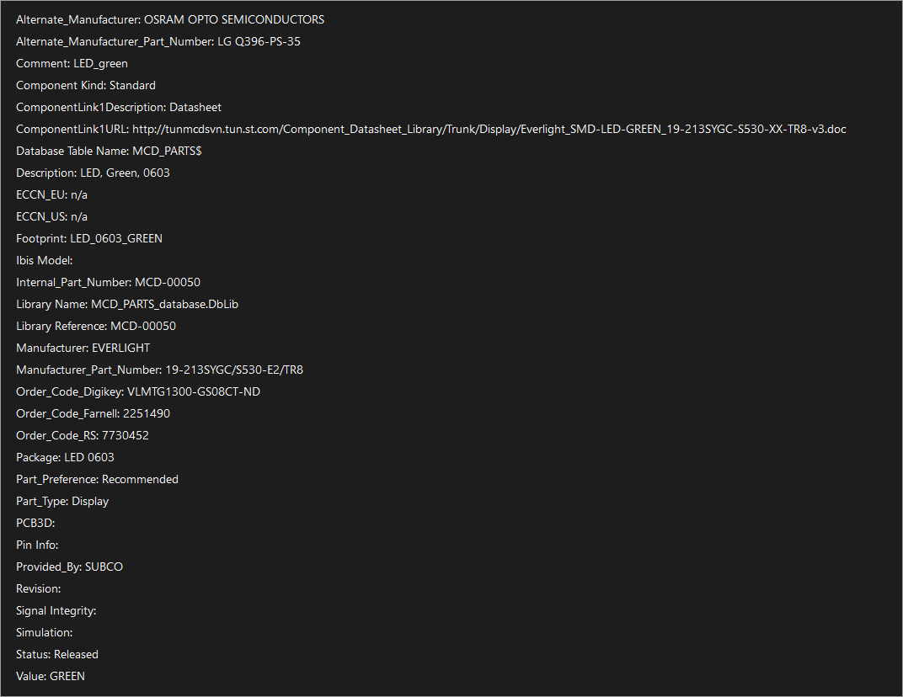

# DataSheet

- [DataSheet](#datasheet)
  - [Board Data Sheet](#board-data-sheet)
    - [nucleo-c031c6.pdf](#nucleo-c031c6pdf)
    - [mb1717-c031c6-b02\_schematic.pdf](#mb1717-c031c6-b02_schematicpdf)
    - [LED 찾기 - LD4](#led-찾기---ld4)

## Board Data Sheet
### nucleo-c031c6.pdf
1. Features
   > Nucleo-C031C6 개발 보드의 주요 기능과 사양을 설명합니다. 예를 들어, 보드에 탑재된 마이크로컨트롤러의 특징, 입출력 포트, 메모리 용량 등과 같은 하드웨어 사양이 포함됩니다.
2. Description
   > Nucleo-C031C6 보드의 전체적인 설명과 개요를 제공합니다. 이 항목에서는 보드의 목적, 사용 용도, 구성 요소, 그리고 보드가 어떻게 설계되었는지에 대한 정보를 담고 있습니다.
3. Ordering information
   1. Product marking
      > 보드의 제품 모델 번호, 제조사 코드 등과 같은 제품 식별 정보를 설명합니다.
   2. Codification
      > 제품의 코드화 방식 및 의미를 설명하며, 제품 번호의 구성 요소와 각 코드가 무엇을 의미하는지에 대한 정보를 포함합니다.
4. Development environment
   1. System requirements
      > 개발을 위해 필요한 하드웨어와 소프트웨어 요구 사항을 설명합니다.
   2. Development toolchains
      > 보드와 호환되는 개발 도구 및 툴체인, IDE(통합 개발 환경) 등의 정보를 제공합니다.
   3. Demonstration software
      > 보드의 기능을 시연하기 위한 소프트웨어 및 예제 코드를 설명합니다.
5. Revision history
   > 문서의 버전 기록과 변경 내역을 나열합니다. 이 항목에서는 각 버전의 수정 내용과 날짜 등을 확인할 수 있습니다.

### mb1717-c031c6-b02_schematic.pdf
1. overview
   > MB1717-C031C6-B02 회로도의 전반적인 개요와 주요 구성 요소를 설명합니다. 전체 회로도의 목적과 설계 목표를 제공합니다.
2. MB1717_Top
   > MB1717 모듈의 상단 레이아웃을 보여주며, 모듈의 배치와 연결 구조를 설명합니다.
3. STM32 micro controller IOs
   > STM32 마이크로컨트롤러의 입출력 포트 및 핀 배치를 설명합니다. 각 핀의 기능과 연결 상태를 나타냅니다
4. Arduino Morpho connectors
   > Arduino Morpho 커넥터의 핀 배열과 연결 상태를 설명합니다. Morpho 커넥터는 Nucleo 보드의 확장 포트로 사용됩니다.
5. Power
   > 보드의 전원 공급 방식과 전원 관련 회로를 설명합니다. 전원 입력, 전원 분배, 전압 레귤레이션 등에 대한 정보를 포함합니다.
6. ST Link V2-1
   > ST Link V2-1 디버거와 프로그래머의 회로 구성 및 기능을 설명합니다. ST Link는 STM32 마이크로컨트롤러의 프로그래밍과 디버깅에 사용됩니다.
7. HW Mechanical Parts
   > 보드에 사용된 기계적 부품과 그 배치를 설명합니다. 보드의 구조적 요소와 물리적 설계를 포함합니다.

### LED 찾기 - LD4
mb1717-c031c6-b02_schematic.pdf에서 "LD"를 검색한다.

찾으면 사진과 같이 LED의 상세 정보를 확인할 수 있다. 따로 Pin Info가 뜨지 않는 것을 볼 수 있다.

회로도에서 LD4가 연결된 곳이 `PA5(Arduino D13, Morpho Connector CN10 - 11Pin)`핀인 것을 확인하였다. 다만, 마이크로 컨트롤러 내장 LED는 별도의 핀을 할당할 필요는 없다.
