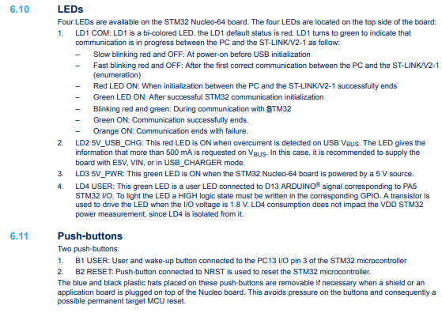

# 0 Setting

- [0 Setting](#0-setting)
  - [Board](#board)
  - [Driver](#driver)
    - [stm32c0xx\_nucleo.h](#stm32c0xx_nucleoh)
    - [stm32c0xx\_nucleo.c](#stm32c0xx_nucleoc)
  - [Core](#core)
    - [main.h](#mainh)
    - [main.c](#mainc)
      - [LED Initialization](#led-initialization)
      - [Turn On the LED](#turn-on-the-led)
      - [GPIO Initialization](#gpio-initialization)

## Board


## Driver
### stm32c0xx_nucleo.h
```c
typedef enum
{
#if defined (USE_NUCLEO_48)
  LED4 = 0,
  LED_GREEN = LED4,
#else
  LED1 = 0,
  LED_GREEN = LED1,
  LED2 = 1,
  LED_BLUE = LED2,
#endif /* USE_NUCLEO_48 */
  LEDn
} Led_TypeDef;
```
ENUM으로 LED를 관리하고 있음. LED4가 회로도에서 Green LED였음.

### stm32c0xx_nucleo.c
LED의 함수 관련 파일임

## Core
### main.h
```c
#include "stm32c0xx_nucleo.h"
```
"stm32c0xx_nucleo.h"에 LED를 포함한 보드의 HW에 대한 정의와 함수들이 포함됨

### main.c
#### LED Initialization
```c
BSP_LED_Init(LED_GREEN);
```
Green LED를 호출 가능한 상태로 설정함(LED_GREEN은 .h에 정의되어 있어야 함)

#### Turn On the LED
```c
BSP_LED_On(LED_GREEN);
```
Green LED를 호출함

#### GPIO Initialization
```c
static void MX_GPIO_Init(void)
{
  /* GPIO Ports Clock Enable */
  __HAL_RCC_GPIOC_CLK_ENABLE();
  __HAL_RCC_GPIOF_CLK_ENABLE();
  __HAL_RCC_GPIOA_CLK_ENABLE();
}
```
clock이 GPIO포트에 접근할 수 있도록 설정함. 포트는 LED가 사용하는 것만 사용함
