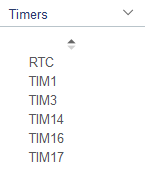
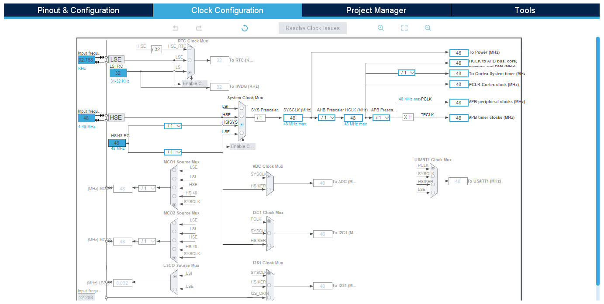
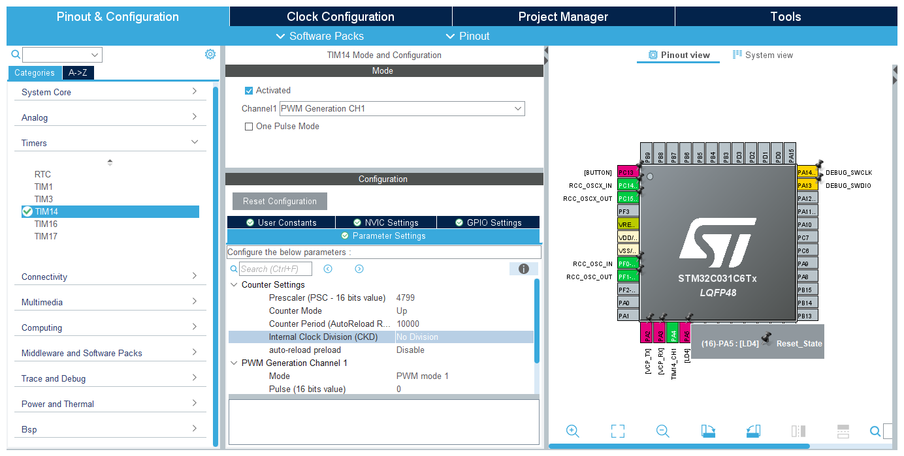
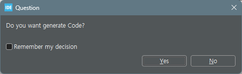

# 3 Blink - Timer

- [3 Blink - Timer](#3-blink---timer)
  - [Timer 선택 및 설정](#timer-선택-및-설정)
    - [Clock Configuration](#clock-configuration)
    - [Pinout \& Configuration](#pinout--configuration)
      - [NVIC Setting](#nvic-setting)
  - [stm32c0xx\_it.c](#stm32c0xx_itc)
  - [main 함수](#main-함수)
  - [interrupt의 코드 만으로 while(1)에 코드가 없지만 작동한다!](#interrupt의-코드-만으로-while1에-코드가-없지만-작동한다)
  - [interrupt \* n](#interrupt--n)

## Timer 선택 및 설정
[TIMER 참고](./../../learned/timer.md)

>LED Blinking은 복잡하지 않고, 모터가 아니므로 `1x 16-bit timer 4 PWM` 혹은 `1x 16-bit timer 1 PWM`중에서 선택'

---


| 타이머   | 타입                      | 특징                                                                                                      |
|----------|---------------------------|-----------------------------------------------------------------------------------------------------------|
| **TIM1** | 16-bit 고급 타이머 (Advanced Timer) | - PWM (Pulse Width Modulation), 타이머 기반의 인코더 인터페이스, 모터 제어와 같은 고급 기능 지원<br>- 두 개의 기본 채널과 두 개의 추가 채널 지원<br>- 캡처/비교 기능 외에도 TI1 및 TI2 입력을 통한 외부 이벤트 감지 및 정밀한 타이밍 제어 가능<br>- 브레이크 기능 제공, PWM 신호 제어 시 안전성 강화 |
| **TIM3** | 16-bit 일반 타이머        | - 기본적인 타이머 기능 제공<br>- PWM, 입력 캡처, 출력 비교 및 타이머 기반의 이벤트 생성 가능<br>- 일반적인 애플리케이션에서 자주 사용 |
| **TIM14**| 16-bit 일반 타이머        | - 제한된 기능을 가진 간단한 타이머<br>- 기본적인 타이머 기능만 제공<br>- PWM 출력과 입력 캡처, 출력 비교 기능 지원<br>- 간단한 타이밍 기능이나 PWM 신호가 필요한 경우 사용 |
| **TIM16**| 16-bit 일반 타이머        | - 일반 타이머로 PWM, 입력 캡처, 출력 비교 기능 지원<br>- TIM1과 비슷하지만, 고급 기능이나 브레이크 기능은 없음<br>- 정밀한 타이밍 제어가 필요한 경우 사용 |
| **TIM17**| 16-bit 일반 타이머        | - TIM16과 유사한 기능을 가진 타이머<br>- TIM16과 동일한 사용 사례를 가짐<br>- 추가 타이머 채널이 필요한 경우 사용 |
| **RTC**  | 실시간 클록 (Real-Time Clock) | - 실시간 시계를 위한 하드웨어<br>- 날짜와 시간을 유지하며 저전력 모드에서도 지속 작동<br>- 32.768 kHz 외부 크리스탈 오실레이터(LSE)와 연결하여 정확한 시간keeping 지원<br>- 알람 기능, 주기적인 인터럽트 생성 지원 |

>간단하게 설정할 수 있고, 16-bit인 PWM기능을 지원하는 `TIM14`를 사용

### Clock Configuration

STM32 마이크로컨트롤러 내장 고속 내부 오실레이터인 `HSI`를 사용하고, clock최대수인 `48MHz`로 맞춘다.

### Pinout & Configuration


- Pin 16에 LD4(User)를 연결해두었다.
- Timer는 TIM14을 사용하기 위해 Clock Source를 Internal Clock으로 설정했다.
- Counter Settings의 Prescaler를 (48MHz / 10KHz) - 1 = 4799로 설정했다.
- 주기인 Counter Period(ARR)은 10000으로 설정했다.

#### NVIC Setting
마지막으로 TIM4 글로벌 인터럽트를 활성화하여 사용한다.


> 이렇게 하고 저장하여 코드를 생성할 경우 주기 +1인 10000(1Hz, 1sec)마다 인터럽트가 생성된다.

## stm32c0xx_it.c
```c
/**
  * @brief This function handles TIM14 global interrupt.
  */
void TIM14_IRQHandler(void)
{
  /* USER CODE BEGIN TIM14_IRQn 0 */
  // Check if TIM14 update interrupt flag is set
  if (__HAL_TIM_GET_FLAG(&htim14, TIM_FLAG_UPDATE) != RESET)
  {
    if (__HAL_TIM_GET_IT_SOURCE(&htim14, TIM_IT_UPDATE) != RESET)
    {
      __HAL_TIM_CLEAR_IT(&htim14, TIM_IT_UPDATE);
      // Toggle LED
      BSP_LED_Toggle(LED_GREEN);
    }
  }
  /* USER CODE END TIM14_IRQn 0 */
  HAL_TIM_IRQHandler(&htim14);
  /* USER CODE BEGIN TIM14_IRQn 1 */
  /* USER CODE END TIM14_IRQn 1 */
}
```
_it는 interrupt의 약자이다.

interrupt가 발생할 때 마다 LED_GREEN을 토글하도록 한 코드이다.

## main 함수
```c
int main(void)
{

  /* USER CODE BEGIN 1 */

  /* USER CODE END 1 */

  /* MCU Configuration--------------------------------------------------------*/

  /* Reset of all peripherals, Initializes the Flash interface and the Systick. */
  HAL_Init();

  /* USER CODE BEGIN Init */

  /* USER CODE END Init */

  /* Configure the system clock */
  SystemClock_Config();

  /* USER CODE BEGIN SysInit */

  /* USER CODE END SysInit */

  /* Initialize all configured peripherals */
  MX_GPIO_Init();
  MX_TIM14_Init();
  /* USER CODE BEGIN 2 */
  /* Start TIM14 in interrupt mode */
    if (HAL_TIM_Base_Start_IT(&htim14) != HAL_OK)
    {
      Error_Handler();
    }
  /* USER CODE END 2 */

  /* Initialize leds */
  BSP_LED_Init(LED_GREEN);

  /* Initialize USER push-button, will be used to trigger an interrupt each time it's pressed.*/
  BSP_PB_Init(BUTTON_USER, BUTTON_MODE_EXTI);

  /* Initialize COM1 port (115200, 8 bits (7-bit data + 1 stop bit), no parity */
  BspCOMInit.BaudRate   = 115200;
  BspCOMInit.WordLength = COM_WORDLENGTH_8B;
  BspCOMInit.StopBits   = COM_STOPBITS_1;
  BspCOMInit.Parity     = COM_PARITY_NONE;
  BspCOMInit.HwFlowCtl  = COM_HWCONTROL_NONE;
  if (BSP_COM_Init(COM1, &BspCOMInit) != BSP_ERROR_NONE)
  {
    Error_Handler();
  }

  /* USER CODE BEGIN BSP */

  /* -- Sample board code to send message over COM1 port ---- */
  printf("Welcome to STM32 world !\n\r");

  /* -- Sample board code to switch on leds ---- */
  BSP_LED_On(LED_GREEN);

  /* USER CODE END BSP */

  /* Infinite loop */
  /* USER CODE BEGIN WHILE */
  while (1)
  {
    /* USER CODE END WHILE */

    /* USER CODE BEGIN 3 */
  }
  /* USER CODE END 3 */
}
```
interrupt의 코드 만으로 while(1)에 코드가 없지만 작동한다! 
---
## interrupt * n
n초동안 텀을 더 두고 싶다면 어떻게 해야 할까

> interrupt ARR을 3초로 바꾸면 된다!

T= (Prescaler+1) × (ARR+1) / Timer Clock 
​
 

`기본 타이머 clock` : 48MHz

`1sec` = (4799 + 1) x (ARR + 1) / 48000000(48MHz)<br>
따라서 ARR = 10000 - 1 = 9999

`3sec` = (4799 + 1) x (ARR + 1) / 48000000<br>
따라서 ARR = 29999
