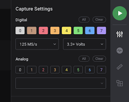

# saleae logic analyzer

- [saleae logic analyzer](#saleae-logic-analyzer)
  - [Logic 2](#logic-2)

usb전원을 사용하여 분석하는 기기

SPI, I2C, Serial 등의 프로토콜을 디코딩할 수 있다.

이 뒷면에는 채널 번호가 적혀 있고, 해당 케이블을 통해 상태를 H/L로 나누어 디코딩할 수 있다.

## Logic 2
파형을 볼 수 있는 프로그램

