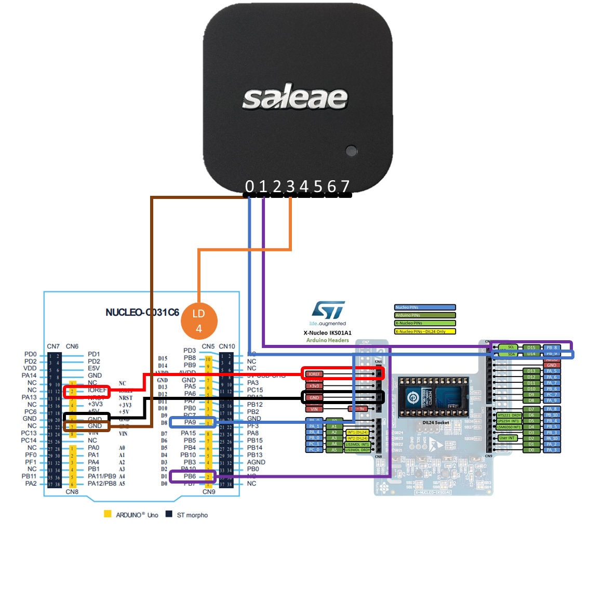
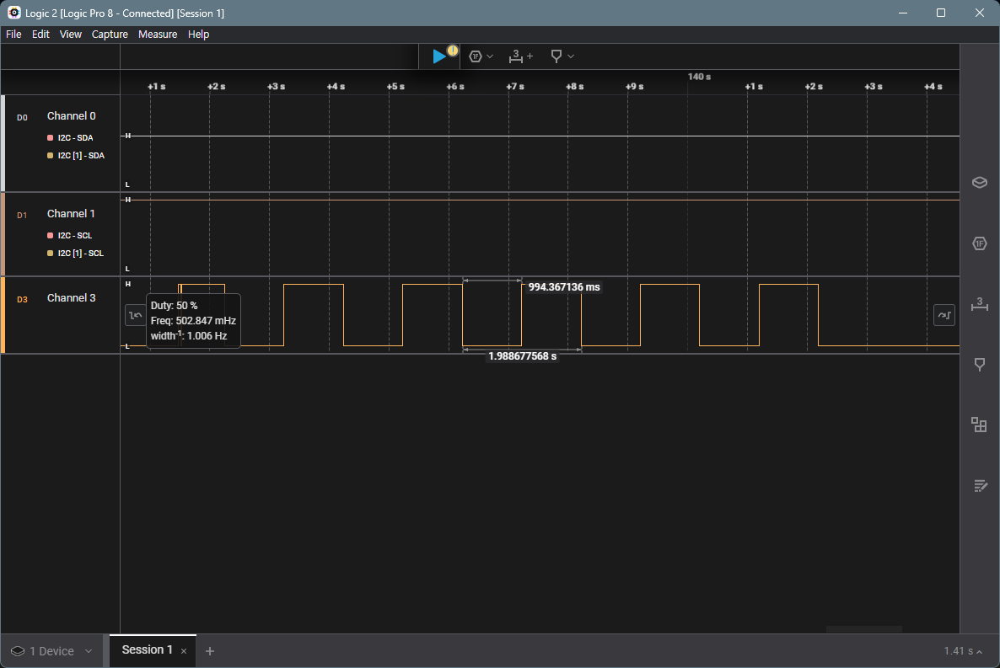
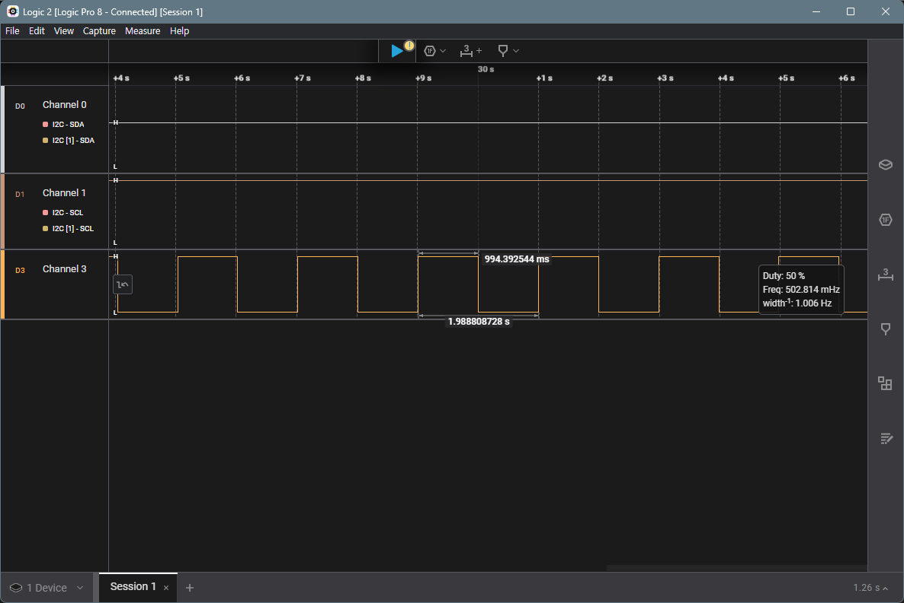

# Setting

- [Setting](#setting)
  - [Circuit](#circuit)
  - [Saleae](#saleae)
    - [tick](#tick)
    - [interrupt](#interrupt)

## Circuit

- 보드 : STM32 NUCLEO-C031C6,
- 모듈 : NUCLEO-IKSO1A1
- 디버깅 : SALEAE Logic Pro 8
---
- `0`번 채널은 모듈의 `I2C의 SDA`와 연결
- `1`번 채널은 모듈의 `II2C의 SCL`과 연결
- `3`번 채널은 stm 보드의 `LD4`로 연결해 Blinking을 확인할 수 있도록 하였다.

## Saleae
### tick

[**2.LED - 5. Blink switch by Button**](../2.%20LED/5_Blink_Button.md)에서 작성한 코드 중 버튼을 한 번 눌렀을 때(`1초 간격으로 blink`)의 상태로 두고 saleae를 측정해보면 다음과 같은 파형을 볼 수 있다.
정확히 `1초는 아니지만, 근접하게 blink되고 있음`을 확인할 수 있었다.

### interrupt

[**2. LED - 3. Blink Timer : Code in Interrupt Handler**](../2.%20LED/3_Blink_Timer(1).md)에서 작성한 코드로 측정해보았다. tick과 동일하게 `1초는 아니지만, 근접하게 blink되고 있음`을 확인할 수 있었다.
