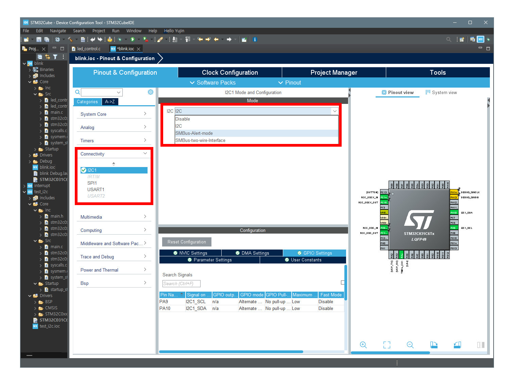
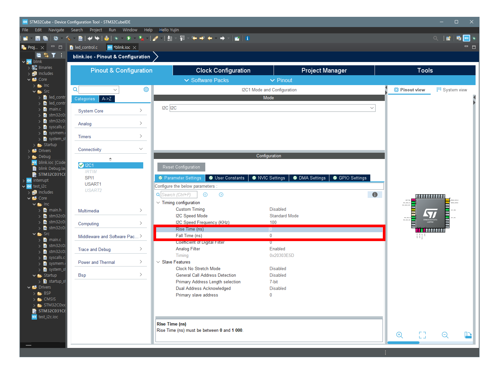
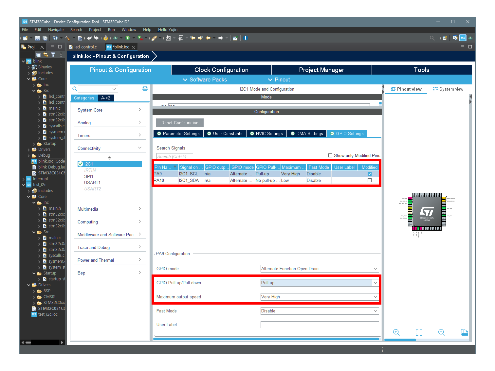
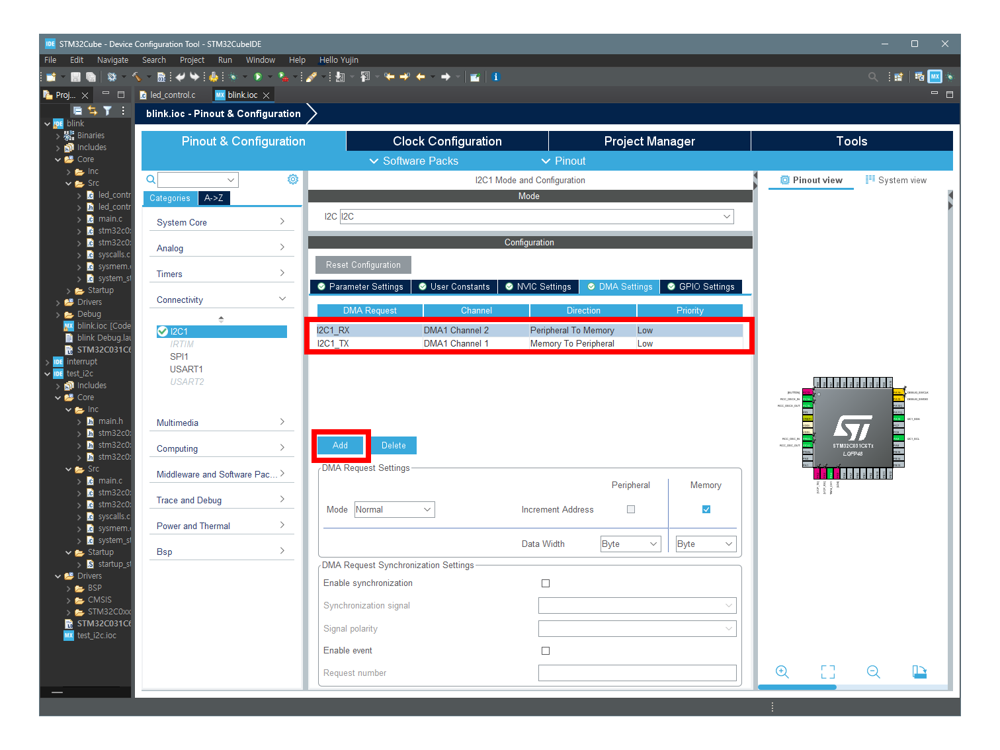

# Setting

- [Setting](#setting)
  - [Circuit](#circuit)
  - [STM32CubeIDE Setting](#stm32cubeide-setting)
    - [I2C Setting](#i2c-setting)
    - [Parameter Setting](#parameter-setting)
    - [GPIO Setting](#gpio-setting)
    - [DMA Setting](#dma-setting)
    - [NVIC Setting](#nvic-setting)
  - [Code](#code)
    - [stm320xx\_it.c](#stm320xx_itc)
    - [stm32c0xx\_hal\_msp.c](#stm32c0xx_hal_mspc)
    - [main.c](#mainc)
  - [Reference](#reference)

## Circuit


- 보드 : STM32 NUCLEO-C031C6,
- 모듈 : NUCLEO-IKSO1A1
- 디버깅 : SALEAE Logic Pro 8
---
- `0`번 채널은 모듈의 `I2C의 SDA`와 연결
- `1`번 채널은 모듈의 `II2C의 SCL`과 연결
- `3`번 채널은 stm 보드의 `LD4`로 연결해 Blinking을 확인할 수 있도록 하였다.

## STM32CubeIDE Setting
### I2C Setting


사진처럼 Connectivity에서 I2C를 활성화할 수 있다.

### Parameter Setting


Parameter중 Rise Time, Fall Time을 0으로 설정하였다.
- Rise Time : L -> H로 전압이 올라가는 데 걸리는 시간
- Fall Time : H -> L로 전압이 떨어지는 데 걸리는 시간

이 두 파라미터는 I2C통신의 속도와 신뢰성에 영향을 미친다. 일반적으로 부하에 따라 조정된다.

바로 변경값을 보기 위해서 Setting을 0으로 하면 되지만, 이 값은 `물리적으로 불가능`하다. 따라서, 100(ns)로 임의 설정하였다.

### GPIO Setting


SCL과 SDA의 GPIO Pull-up/Pull-down을 `Pull-up`으로, Maximum output speed를 `Very High`로 설정했다.

**Pull-up 설정**

Pull-up: GPIO 핀에 내장된 저항을 사용하여 기본 전압을 높게 유지합니다. 이 설정은 SCL과 SDA 라인이 기본적으로 HIGH 상태를 유지하게 하여, I2C 통신 시 안정적인 시작 상태를 보장합니다. I2C 프로토콜에서 SDA와 SCL 라인은 오픈 드레인(open-drain) 방식으로 동작하므로, 기본적으로 HIGH 상태를 유지하는 것이 필요합니다.

**Maximum Output Speed 설정**

Very High: GPIO의 최대 출력 속도를 매우 높게 설정한 것입니다. 이는 SCL의 주파수를 높일 수 있도록 하여, I2C 통신의 데이터 전송 속도를 증가시킵니다. 그러나 너무 높은 속도로 설정하면 신호의 rise time과 fall time이 짧아져서 전송 오류가 발생할 수 있으므로, 이를 고려해야 합니다.

### DMA Setting


SDA, SCL의 채널을 설정하였다.

### NVIC Setting


DMA Setting을 하면 사진과 같이 채널이 [NVIC](/stm32/learned/NVIC.md)에 생성된다.

체크 박스(interrupt enabled)를 활성화하면 인터럽트를 사용하겠다는 뜻이다.

## Code
아래는 [Setting](#setting)후 생성된 코드에 대한 설명이다.

### stm320xx_it.c
파일의 하단에 I2C관련 인터럽터가 생성되었다. `송수신, 오류 및 이벤트` 관련 코드가 있다.

- `DMA1_Channel1_IRQHandler(void)`
  - DMA 채널 1의 인터럽트를 처리함.
  - `I2C 송신`과 관련된 DMA 전송이 완료되면 이 핸들러가 호출되어 송신 처리를 수행함.
  <details>
    <summary>DMA1_Channel1_IRQHandler(void)</summary>

    ```c
    /**
      * @brief This function handles DMA1 channel 1 interrupt.
      */
    void DMA1_Channel1_IRQHandler(void)
    {
      /* USER CODE BEGIN DMA1_Channel1_IRQn 0 */

      /* USER CODE END DMA1_Channel1_IRQn 0 */
      HAL_DMA_IRQHandler(&hdma_i2c1_tx);
      /* USER CODE BEGIN DMA1_Channel1_IRQn 1 */

      /* USER CODE END DMA1_Channel1_IRQn 1 */
    }
    ```
  </details>

- `DMA1_Channel2_3_IRQHandler(void)`
  - DMA1 채널 2와 3의 인터럽트를 처리함.
  - `I2C 수신`과 관련된 DMA 전송이 완료되면 이 핸들러가 호출되어 수신 처리를 수행함.
  <details>
    <summary>DMA1_Channel1_IRQHandler(void)</summary>

    ```c
    /**
      * @brief This function handles DMA1 channel 2 and channel 3 interrupts.
      */
    void DMA1_Channel2_3_IRQHandler(void)
    {
      /* USER CODE BEGIN DMA1_Channel2_3_IRQn 0 */

      /* USER CODE END DMA1_Channel2_3_IRQn 0 */
      HAL_DMA_IRQHandler(&hdma_i2c1_rx);
      /* USER CODE BEGIN DMA1_Channel2_3_IRQn 1 */

      /* USER CODE END DMA1_Channel2_3_IRQn 1 */
    }
    ```
  </details>

- `I2C1_IRQHandler(void)`
  - I2C1의 인터럽트를 처리하며, 오류 및 이벤트를 관리함.
  - `I2C 상태 레지스터 (ISR)를 통해 오류 플래그(BERR, ARLO, OVR)가 설정되었는지 확인`함.
    - BERR: 버스 오류
    - ARLO: 어드레스 실패
    - OVR: 오버런 오류
  - 이러한 오류가 감지되면 `HAL_I2C_ER_IRQHandler(&hi2c1)`를 호출하여 오류 처리를 수행함.
  - 오류가 없다면 데이터 전송 또는 수신 이벤트를 처리하기 위해 `HAL_I2C_EV_IRQHandler(&hi2c1)`를 호출함.
  <details>
    <summary>DMA1_Channel1_IRQHandler(void)</summary>

    ```c
    /**
      * @brief This function handles I2C1 interrupt (combined with EXTI 23).
      */
    void I2C1_IRQHandler(void)
    {
      /* USER CODE BEGIN I2C1_IRQn 0 */

      /* USER CODE END I2C1_IRQn 0 */
      if (hi2c1.Instance->ISR & (I2C_FLAG_BERR | I2C_FLAG_ARLO | I2C_FLAG_OVR)) {
        HAL_I2C_ER_IRQHandler(&hi2c1);
      } else {
        HAL_I2C_EV_IRQHandler(&hi2c1);
      }
      /* USER CODE BEGIN I2C1_IRQn 1 */

      /* USER CODE END I2C1_IRQn 1 */
    }
    ```
  </details>

### stm32c0xx_hal_msp.c
`STM32 HAL 라이브러리에서 MSP기능을 구현`하는 코드를 가지고 있다. `주로 HW 초기화와 관련`된 설정이다.

- `stm32c0xx_hal_dma.h`의 `DMA_HandleTypeDef`에서 extern하여 관련 설정을 선언. 
  - `DMA를 사용하여 CPU 개입 없이 데이터를 전송`할 수 있다.
  <details>
    <summary>DMA_HandleTypeDef</summary>

    ```c
    extern DMA_HandleTypeDef hdma_i2c1_rx;
    extern DMA_HandleTypeDef hdma_i2c1_tx;
    ```
  </details>

- `HAL_MspInit(void)`
  - `전역 MSP(메인 시스템 초기화) 함수`로 시스템 구성 및 필요한 클럭을 활성화함.
  - 여기에서는 `SYSCFG`, `PWR(Power Control) 클럭`을 활성화함.
  <details>
    <summary>HAL_MspInit(void)</summary>

    ```c
    void HAL_MspInit(void)
    {
      __HAL_RCC_SYSCFG_CLK_ENABLE();
      __HAL_RCC_PWR_CLK_ENABLE();
    }
    ```
  </details>

- `HAL_I2C_MspInit(I2C_HandleTypeDef* hi2c)`
  - GPIO핀을 설정하고 DMA 및 인터럽트를 초기화하여 I2C통신에 적합하게 함.
  <details>
    <summary>HAL_I2C_MspInit(I2C_HandleTypeDef* hi2c)</summary>

    ```c
    void HAL_I2C_MspInit(I2C_HandleTypeDef* hi2c)
    {
      // ... clock and GPIO configuration ...
      HAL_GPIO_Init(GPIOA, &GPIO_InitStruct);
      // ... DMA initialization ...
      HAL_NVIC_SetPriority(I2C1_IRQn, 0, 0);
      HAL_NVIC_EnableIRQ(I2C1_IRQn);
    }
    ```
  </details>

- `HAL_I2C_MspDeInit(I2C_HandleTypeDef* hi2c)`
  - I2C장치의 리소스를 해제하고 GPIO 핀 및 DMA를 비활성화, 인터럽트를 해제함.
  <details>
    <summary>HAL_I2C_MspDeInit(I2C_HandleTypeDef* hi2c)</summary>
    
    ```c
    void HAL_I2C_MspDeInit(I2C_HandleTypeDef* hi2c)
    {
      __HAL_RCC_I2C1_CLK_DISABLE();
      HAL_GPIO_DeInit(GPIOA, GPIO_PIN_9);
      HAL_GPIO_DeInit(GPIOA, GPIO_PIN_10);
      HAL_DMA_DeInit(hi2c->hdmarx);
      HAL_DMA_DeInit(hi2c->hdmatx);
      HAL_NVIC_DisableIRQ(I2C1_IRQn);
    }
    ```
  </details>

- `HAL_TIM_Base_MspInit` 및 `HAL_TIM_Base_MspDeInit`
  - TIM14 타이머의 초기화 및 해제 함수.
  <details>
    <summary>HAL_TIM_Base_MspInit</summary>
    
    ```c
    void HAL_TIM_Base_MspInit(TIM_HandleTypeDef* htim_base)
    {
      __HAL_RCC_TIM14_CLK_ENABLE();
    }
    ```
  </details>
  <details>
    <summary>HAL_TIM_Base_MspDeInit</summary>

    ```c
    void HAL_TIM_Base_MspDeInit(TIM_HandleTypeDef* htim_base)
    {
      __HAL_RCC_TIM14_CLK_DISABLE();
    }
    ```
  </details>

- `HAL_TIM_MspPostInit`
  - 타이머 초기화 후 추가적인 GPIO 설정을 한다. TIM14의 채널 1을 위한 핀을 설정하는 함수.
  <details>
    <summary>HAL_TIM_MspPostInit</summary>

    ```c
    void HAL_TIM_MspPostInit(TIM_HandleTypeDef* htim)
    {
      HAL_GPIO_Init(GPIOA, &GPIO_InitStruct);
    }
    ```
  </details>

### main.c
`I2C 통신을 설정`하고,  `DMA를 통해 데이터를 비동기적으로 송수신할 수 있도록 초기화`된 코드가 생성된다. 더불어 `I2C 통신 중 발생가능한 오류와 이벤트 처리를 위한 인터럽트 핸들러`를 설정한다.

- `Handler`
  - `I2C_HandleTypeDef hi2c1` : I2C1의 설정과 상태를 관리.
  - `DMA_HandleTypeDef` : I2C 통신에 사용되는 `수신 및 송신 DMA 핸들러`.
  <details>
    <summary>Handler</summary>

    ```c
    I2C_HandleTypeDef hi2c1;
    DMA_HandleTypeDef hdma_i2c1_rx;
    DMA_HandleTypeDef hdma_i2c1_tx;
    ```
  </details>
- `I2C1 Initialization`
  - MX_I2C1_Init: I2C1의 초기 설정을 정의하는 함수입니다. 타이밍, 주소 모드, 필터 등을 설정하고 HAL 라이브러리를 통해 초기화합니다.
각 설정값은 I2C 통신의 성능과 안정성을 결정합니다.
  <details>
    <summary>I2C1 Initialization</summary>

    ```c
    static void MX_I2C1_Init(void)
    {
        hi2c1.Instance = I2C1;
        hi2c1.Init.Timing = 0x10805D88;  // I2C 타이밍 설정
        hi2c1.Init.OwnAddress1 = 0;      // 주 장치 주소
        hi2c1.Init.AddressingMode = I2C_ADDRESSINGMODE_7BIT; // 7비트 주소 모드
        hi2c1.Init.DualAddressMode = I2C_DUALADDRESS_DISABLE; // 이중 주소 모드 비활성화
        hi2c1.Init.OwnAddress2 = 0;      // 두 번째 주소 (사용 안 함)
        hi2c1.Init.OwnAddress2Masks = I2C_OA2_NOMASK; // 두 번째 주소 마스크
        hi2c1.Init.GeneralCallMode = I2C_GENERALCALL_DISABLE; // 일반 호출 모드 비활성화
        hi2c1.Init.NoStretchMode = I2C_NOSTRETCH_DISABLE; // 스톱 모드 비활성화
        if (HAL_I2C_Init(&hi2c1) != HAL_OK)
        {
            Error_Handler(); // 초기화 실패 시 오류 처리
        }

        // 아날로그 필터 및 디지털 필터 설정
        if (HAL_I2CEx_ConfigAnalogFilter(&hi2c1, I2C_ANALOGFILTER_ENABLE) != HAL_OK)
        {
            Error_Handler(); // 필터 설정 실패 시 오류 처리
        }
        if (HAL_I2CEx_ConfigDigitalFilter(&hi2c1, 0) != HAL_OK)
        {
            Error_Handler(); // 필터 설정 실패 시 오류 처리
        }
    }
    ```
  </details>

- `DMA Initialization`
  - DMA를 사용하여 I2C 통신의 수신 및 송신을 비동기적으로 처리하기 위한 초기화 코드입니다. DMA의 인터럽트를 설정하고 활성화합니다.
  <details>
    <summary>DMA Initialization</summary>

    ```c
    static void MX_DMA_Init(void)
    {
        __HAL_RCC_DMA1_CLK_ENABLE(); // DMA1 클럭 활성화
        HAL_NVIC_SetPriority(DMA1_Channel1_IRQn, 0, 0); // DMA1 채널 1의 인터럽트 우선순위 설정
        HAL_NVIC_EnableIRQ(DMA1_Channel1_IRQn); // DMA1 채널 1 인터럽트 활성화
        HAL_NVIC_SetPriority(DMA1_Channel2_3_IRQn, 0, 0); // DMA1 채널 2/3의 인터럽트 우선순위 설정
        HAL_NVIC_EnableIRQ(DMA1_Channel2_3_IRQn); // DMA1 채널 2/3 인터럽트 활성화
    }
    ```
  </details>

- `Interrupt Handler`
  - 인터럽트 발생 시 호출
  - I2C 오류 플래그 검사
    - `오류시 오류 핸들러` 호출
    - `정상시 이벤트 핸들러` 호출하여 통신이벤트 처리
  <details>
    <summary>Interrupt Handler</summary>

    ```c
    void I2C1_IRQHandler(void)
    {
        if (hi2c1.Instance->ISR & (I2C_FLAG_BERR | I2C_FLAG_ARLO | I2C_FLAG_OVR)) {
            HAL_I2C_ER_IRQHandler(&hi2c1); // 오류 핸들러 호출
        } else {
            HAL_I2C_EV_IRQHandler(&hi2c1); // 이벤트 핸들러 호출
        }
    }
    ```
  </details>

## Reference
[STM32 - Getting started with I2C](https://wiki.st.com/stm32mcu/wiki/Getting_started_with_I2C)
